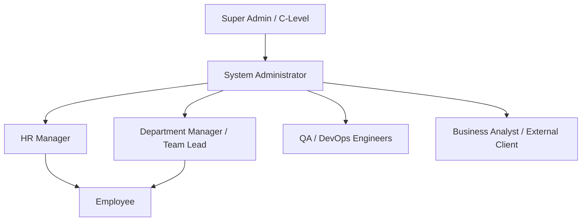

# 1. Project Overview

## 1.1 Project Introduction
The **Office Management System (OMS)** is a multi-tenant, enterprise-grade Operations & Resource Management platform built to consolidate core organizational workflows into a single unified application. It integrates Human Capital Management (HCM), Attendance Tracking, Leave Workflows, Automated Payroll Processing, Project & Task Lifecycle Management, Daily Work Reporting, KPI Appraisals, Real-time Meetings, Internal Announcements, Web-Push Notifications, Granular RBAC Permissions, and Advanced Analytics.

Designed for scalable organizational deployment, OMS eliminates software fragmentation, manual data synchronization, and departmental communication silos by providing a real-time, event-driven architecture powered by React, Node.js, Express, MongoDB, Socket.io, and Redis.

---

## 1.2 Business Problem
Modern enterprises often suffer from operational inefficiency due to fragmented software ecosystems:
- **Disjointed Systems**: Attendance punched in bio-metric standalone hardware, leave requested over emails, tasks managed in third-party boards, and payroll processed on manual spreadsheets.
- **Data Inconsistency & Delays**: Manual data transfer between attendance records and payroll calculations results in errors, delayed salary disbursements, and compliance risks.
- **Lack of Real-time Visibility**: Executives and department managers lack unified dashboard visibility into employee availability, project progress, task blockages, and employee performance KPIs.
- **Weak Access Control & Audit Gaps**: Generic user roles often expose sensitive payroll data or fail to record detailed audit trails for critical business actions.

---

## 1.3 Strategic Objectives
OMS is engineered to address these challenges through clear strategic milestones:
1. **Single Source of Truth**: Provide a centralized database for all employee records, operations, projects, financial calculations, and performance metrics.
2. **Automated Operational Workflows**: Automate monthly payroll generation, leave accruals, attendance status calculations, late mark penalties, and performance scoring.
3. **Real-time Event Architecture**: Deliver instant web push notifications, interactive socket-driven chat/announcements, and live task/attendance status updates.
4. **Zero-Trust Security & Granular Access**: Implement fine-grained Role-Based Access Control (RBAC) with dynamic permission matrices down to feature-action resource levels.
5. **High Reliability & Scalability**: Ensure sub-100ms API response times, 99.9% system availability, and seamless horizontal scaling.

---

## 1.4 Key Features Matrix

| Feature Area | Key Capability | Business Value |
| :--- | :--- | :--- |
| **Identity & Access** | JWT Authentication, Refresh Token Rotation, RBAC & Dynamic Permission Matrix | Secures organizational assets and limits data exposure |
| **Attendance & Geofencing** | Web Punch, Geo-location verification, IP Whitelisting, Automated Late/Overtime rules | Prevents proxy attendance and automates timekeeping |
| **Leave Management** | Multi-tier Leave Request, Automatic Accruals, Carry-forward, Sandbox balances | Eliminates manual leave tracking errors |
| **Automated Payroll** | Salary Structure builder, Tax/Deduction engine, Automatic Payslip generation | Speeds up payroll processing with zero manual calculations |
| **Project & Tasks** | Kanban boards, Task dependencies, Sub-task tracking, Milestone tracking | Improves project velocity and resource allocation |
| **KPI & Appraisals** | Customizable evaluation templates, Self-review, Manager rating, Scoring matrix | Standardizes performance evaluations across teams |
| **Communications** | Real-time Meetings, Socket Announcements, Multi-channel Web Push Notifications | Fosters organizational transparency and instant alignment |
| **Audit & Governance** | System Audit Logs, Security Event tracking, IP & User Agent logging | Ensures regulatory compliance and internal traceability |

---

## 1.5 Target User Personas

1. **Super Admin / C-Level Executives**: Requires high-level organizational insights, company-wide KPI metrics, expenditure reports, and global security audit logs.
2. **System Administrators**: Manages tenant setup, branch/department hierarchies, system settings, global permission matrices, and security policies.
3. **HR Managers**: Oversees onboarding, employee lifecycle, leave approvals, attendance corrections, performance appraisals, and monthly payroll processing.
4. **Department Managers & Team Leads**: Assigns tasks, reviews daily work reports, evaluates team KPIs, approves leaves, and monitors project milestones.
5. **Employees**: Uses self-service portal for clocking attendance, submitting daily work reports, requesting leaves, tracking assigned tasks, viewing payslips, and participating in meetings.
6. **QA & DevOps Engineers**: Monitors API health, Socket connection pools, Redis cache hit ratios, background worker logs, and CI/CD deployment pipelines.
7. **Business Analysts & Clients**: Interacts with project tracking views, generated analytical reports, and milestone delivery metrics.
