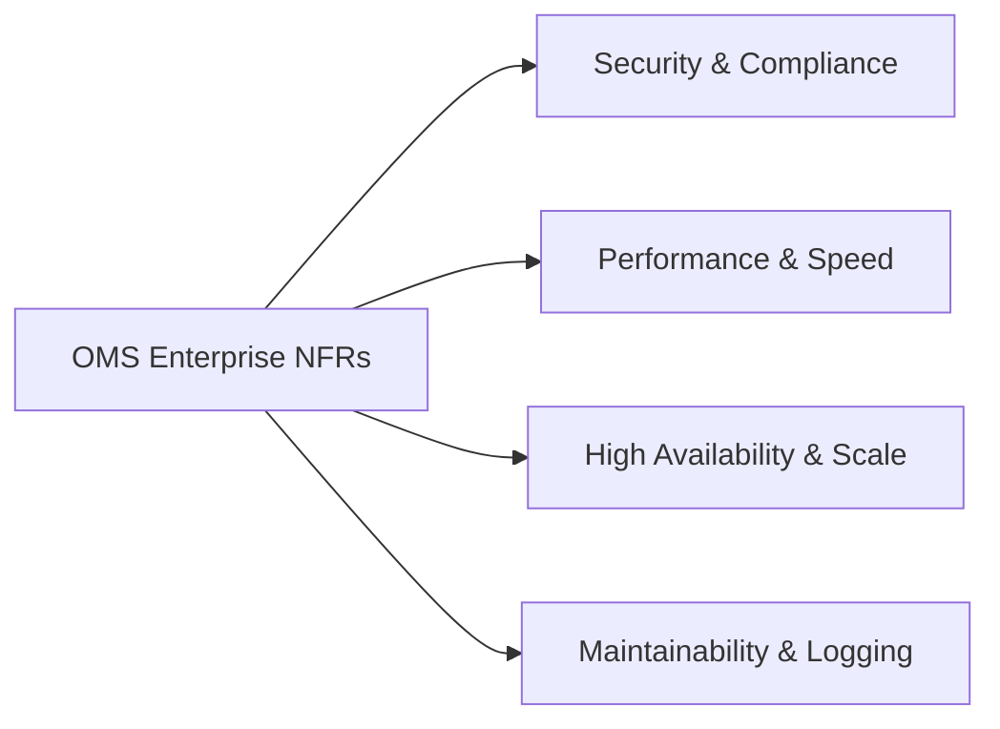

# 2. Functional & Non-Functional Requirements

## 2.1 Functional Requirements Specifications

The OMS enterprise application fulfills functional specifications grouped across 20 primary module domains:

### 2.1.1 Authentication & Identity Domain
- **FR-AUTH-01**: The system MUST support secure login via Email/Username and Password, returning a short-lived JSON Web Token (JWT access token) and HTTP-only Refresh Token.
- **FR-AUTH-02**: The system MUST support Multi-Factor Authentication (MFA) via TOTP / Authenticator apps for administrative roles.
- **FR-AUTH-03**: The system MUST implement account lockout policies after 5 consecutive failed login attempts within a 15-minute window.
- **FR-AUTH-04**: The system MUST allow self-service password reset via encrypted email tokens expiring within 30 minutes.

### 2.1.2 Employee Management Domain
- **FR-EMP-01**: The system MUST maintain complete employee profile records (Personal, Official, Financial, Emergency Contact, and Documents).
- **FR-EMP-02**: The system MUST auto-generate unique Employee IDs based on company customizable prefix counter patterns.
- **FR-EMP-03**: The system MUST support soft deletion/deactivation of employees while preserving historical attendance, payroll, and audit records.

### 2.1.3 Attendance & Geofencing Domain
- **FR-ATT-01**: Employees MUST be able to punch Check-In and Check-Out with real-time browser geo-location coordinate verification.
- **FR-ATT-02**: System MUST mark attendance status as `Present`, `Late`, `Half Day`, or `Absent` based on shift start times and configurable grace periods.
- **FR-ATT-03**: Employees MUST be able to submit Attendance Correction Requests for missed punches, subject to manager/HR approval.

### 2.1.4 Leave Management Domain
- **FR-LVE-01**: System MUST support configurable leave types (`Casual`, `Sick`, `Earned`, `Maternity`, `Paternity`, `Unpaid`) with annual quota allocations.
- **FR-LVE-02**: System MUST automatically calculate working day counts, skipping weekends and official company holidays.
- **FR-LVE-03**: System MUST execute a multi-tier approval workflow (Manager approval followed by HR confirmation).

### 2.1.5 Payroll & Salary Domain
- **FR-PAY-01**: System MUST build salary structures using base salary, allowances (HRA, DA, Conveyance, Special), and deductions (Tax, PF, ESI, Unpaid Leave deductions).
- **FR-PAY-02**: System MUST execute monthly automated payroll calculations based on monthly attendance summaries and approved leave records.
- **FR-PAY-03**: System MUST generate downloadable PDF payslips with cryptographically verifiable checksums.

### 2.1.6 Project & Task Management Domain
- **FR-PRJ-01**: System MUST allow creation of projects with milestones, budgets, allocated team members, and priority levels.
- **FR-PRJ-02**: System MUST support Kanban task boards with status stages (`Backlog`, `To Do`, `In Progress`, `In Review`, `Completed`).
- **FR-PRJ-03**: System MUST record time logs against specific tasks and calculate project burn-down metrics.

### 2.1.7 Performance & KPI Domain
- **FR-KPI-01**: System MUST support periodic KPI evaluation cycles (Monthly, Quarterly, Annual).
- **FR-KPI-02**: System MUST support multi-rater scoring (Self Evaluation + Manager Evaluation + Final Score calculation).
- **FR-KPI-03**: System MUST calculate performance grade bands (e.g., Exceeds Expectations, Meets Expectations, Needs Improvement).

### 2.1.8 Communication & Notifications Domain
- **FR-COM-01**: System MUST broadcast company and department level announcements with mandatory read receipts/acknowledgments.
- **FR-COM-02**: System MUST schedule real-time meetings with room links, agenda, and automated Web-Push reminders.
- **FR-COM-03**: System MUST deliver instant notifications via Socket.io for active browser sessions and Web Push API for background sessions.

---

## 2.2 Non-Functional Requirements (NFRs)

### 2.2.1 Performance Requirements
- **Latency SLA**: 95% of standard read API endpoints MUST respond in under **50ms**; write operations MUST complete within **120ms**.
- **Page Load Time**: Initial frontend application render time MUST be less than **1.5 seconds** on a standard broadband connection.
- **Real-time Latency**: Socket event propagation across connected clients MUST take less than **30ms**.

### 2.2.2 Security & Compliance
- **Authentication**: JWT signed using RS256 algorithm with 15-minute access token TTL and 7-day secure HTTP-only refresh tokens.
- **Data at Rest Encryption**: Sensitive database fields (SSN, Bank Details, Salary figures) MUST be encrypted using AES-256-GCM.
- **Data in Transit**: All network communications MUST be enforced over TLS 1.3.
- **OWASP Compliance**: Built-in defenses against SQL/NoSQL Injection, Cross-Site Scripting (XSS), CSRF, and Broken Object Level Authorization (BOLA).

### 2.2.3 Scalability & Availability
- **System Availability SLA**: 99.9% operational uptime (maximum 8.76 hours unscheduled downtime per year).
- **Horizontal Scaling**: Backend services MUST support stateless horizontal scaling via Node.js cluster mode / Docker instances behind Nginx.
- **Cache Acceleration**: Redis distributed cache MUST handle session tracking, rate limit counting, and frequent read query acceleration (e.g. employee permissions, company settings).

### 2.2.4 Maintainability & Logging
- **Structured Logging**: All application logs MUST be output in JSON format utilizing Winston logger, categorized into `info`, `warn`, `error`, and `security_audit`.
- **Error Tracking**: Global error boundary middleware MUST capture unhandled exceptions, append stack traces, log client context, and return standardized RFC-7807 error responses.

### 2.2.5 Accessibility & Compatibility
- **WCAG 2.1 AA**: UI components MUST meet WCAG 2.1 Level AA contrast and keyboard navigation standards.
- **Cross-Browser Support**: Chrome (v100+), Firefox (v100+), Edge (v100+), Safari (v15+), Mobile Safari, and Chrome for Android.
