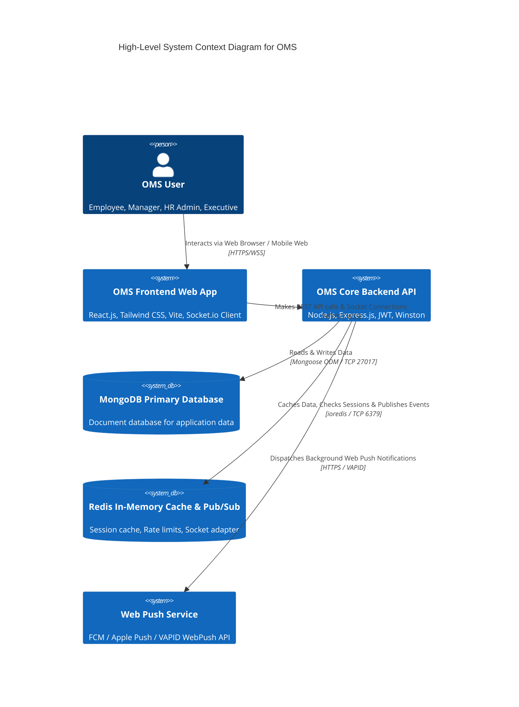
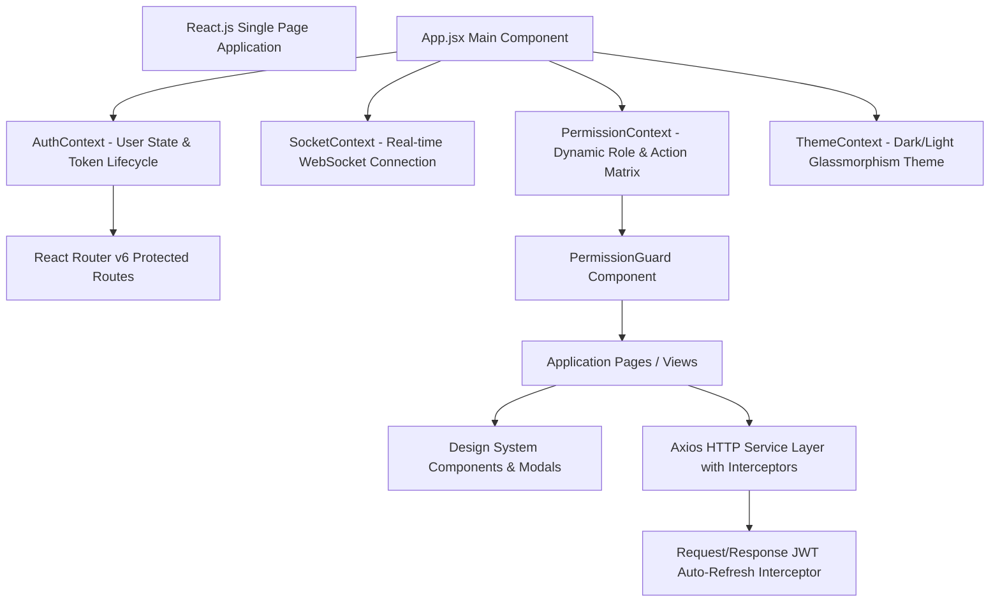
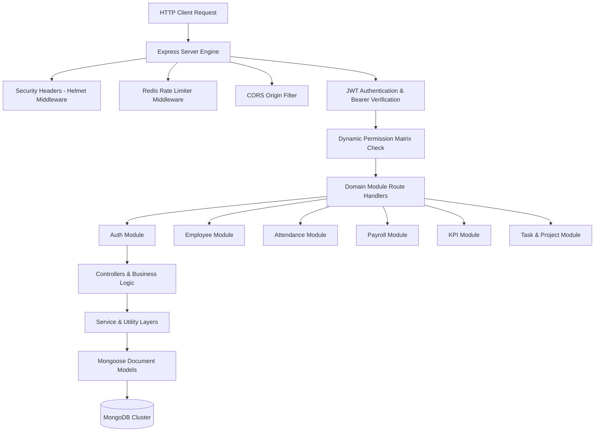
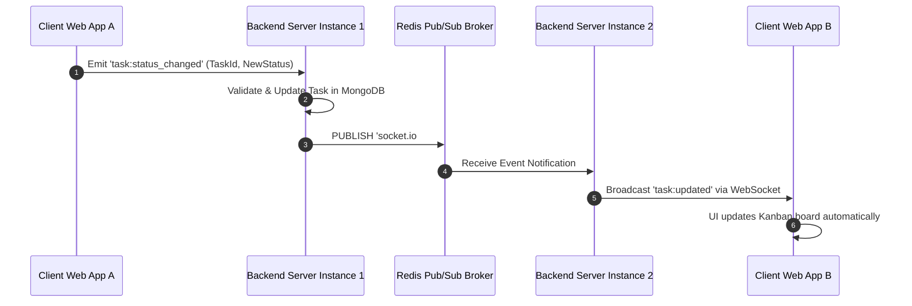
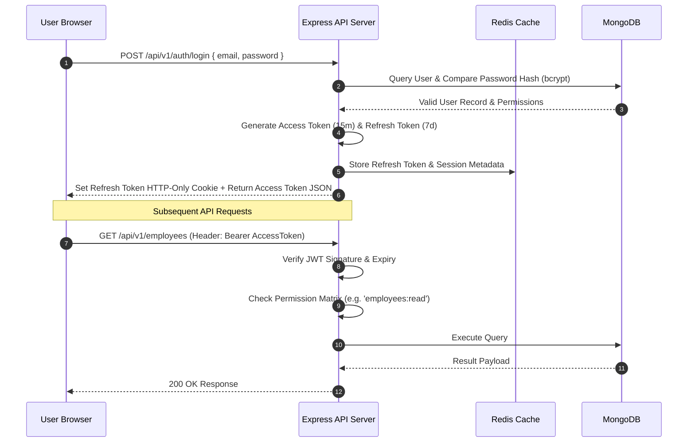
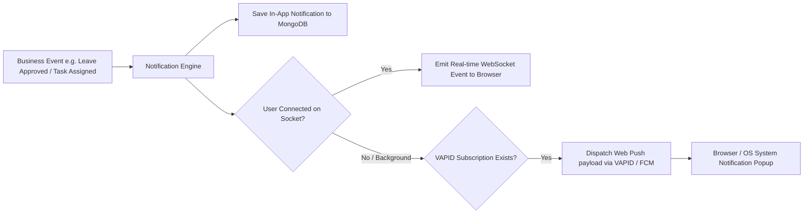

# 3. System Architecture

## 3.1 Overall High-Level System Architecture (C4 Model)

The Office Management System (OMS) employs a modern, decoupled, multi-tiered micro-service ready architecture. The application separates client rendering, stateless RESTful API orchestration, real-time WebSocket communication, caching layers, and persistence mechanisms.

---

## 3.2 Frontend Architecture

The frontend is built using React.js (Vite build engine) utilizing functional components, custom hooks, and centralized state management via React Context API alongside specialized providers.

---

## 3.3 Backend Architecture

The backend architecture follows Domain-Driven Modular Design pattern. Each domain module encapsulates its own routes, controllers, services, validation schemas, and database models.

---

## 3.4 Real-Time & Event Architecture (Socket.io & Redis Flow)

To ensure low-latency real-time synchronization across multi-instance backend deployments, OMS leverages Socket.io backed by Redis Pub/Sub Adapter.

---

## 3.5 Authentication & Authorization Security Flow

OMS uses a dual-token authentication scheme (Access Token + Refresh Token) combined with an in-memory Redis token revocation list.

---

## 3.6 Web Push & Real-Time Notification Pipeline

