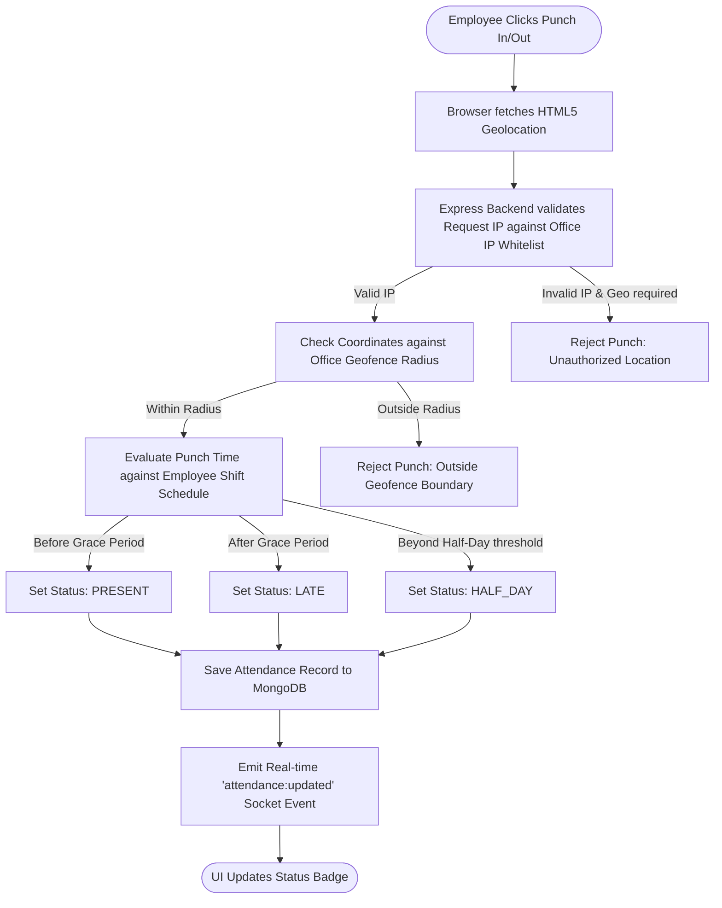
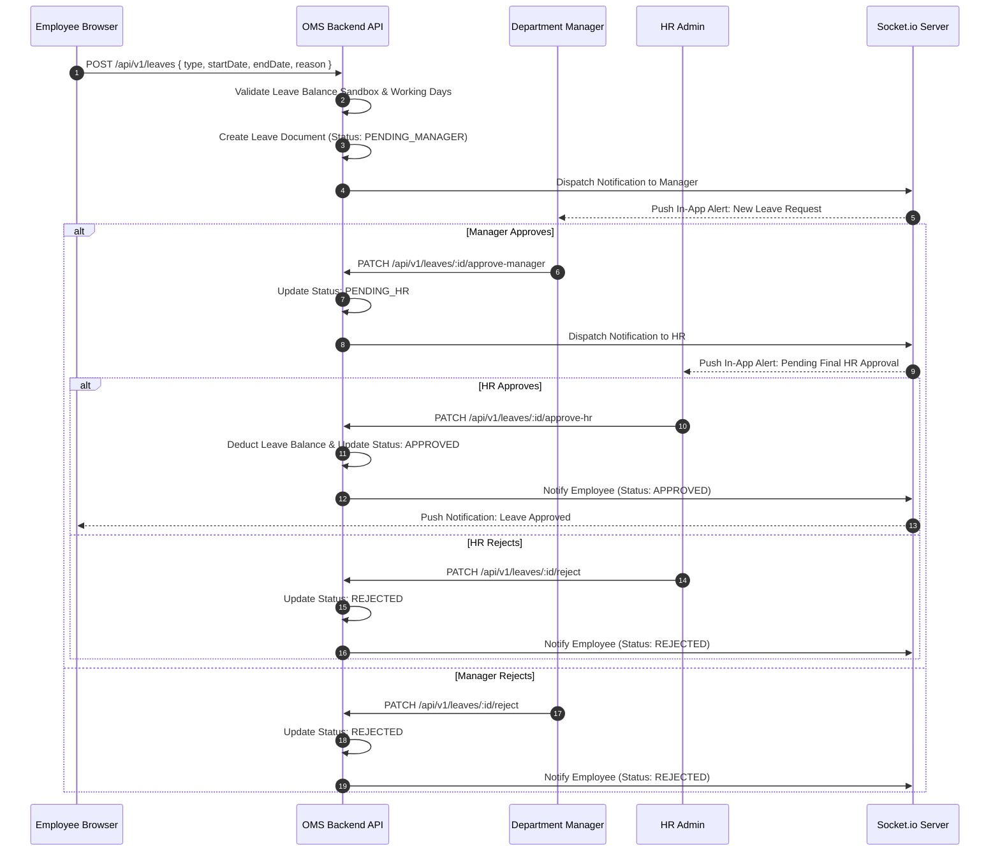
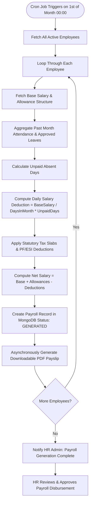

# 6. Workflow & UI Specifications

## 6.1 Enterprise End-to-End Workflows

This section provides visual flowcharts and sequence diagrams detailing the 12 core application workflows executed in OMS.

### 6.1.1 Geo-Fenced Web Attendance Punching Workflow

---

### 6.1.2 Multi-Tier Leave Request & Approval Workflow

---

### 6.1.3 Monthly Automated Payroll Calculation Workflow

---

## 6.2 UI Screen Specifications

OMS features a responsive, high-contrast, accessibility-compliant user interface built with React, Tailwind CSS, and glassmorphism styling patterns.

### 6.2.1 Core Screens Inventory

| Screen ID | Screen Name | Key UI Components | Buttons & Controls | Primary API Endpoint |
| :--- | :--- | :--- | :--- | :--- |
| `SCR-01` | **Login View** | Card Container, Brand Logo, Login Form, Password Visibility Toggle, MFA Input Modal | `Sign In`, `Forgot Password?`, `Submit MFA` | `POST /api/v1/auth/login` |
| `SCR-02` | **Executive Dashboard** | Metric Cards, Revenue vs Cost Chart, Attendance Pie Chart, Active Projects Table | `Date Range Filter`, `Export PDF`, `Refresh Data` | `GET /api/v1/dashboard/executive` |
| `SCR-03` | **Employee Directory** | Filter Drawer, Search Bar, Grid/List Toggle, Employee Table, Action Menu | `+ Add Employee`, `Filter`, `Export CSV`, `View Profile` | `GET /api/v1/employees` |
| `SCR-04` | **Web Punch Portal** | Live Digital Clock, Geo-location Status Indicator, Action Card, Today's Punch Timeline | `Check In Now`, `Check Out`, `Request Correction` | `POST /api/v1/attendance/check-in` |
| `SCR-05` | **Leave Management** | Quota Summary Widgets, Application Form Modal, Approval Timeline, Leave History Table | `+ Apply Leave`, `Approve`, `Reject`, `Cancel` | `GET /api/v1/leaves` |
| `SCR-06` | **Kanban Task Board** | Drag-and-Drop Columns (`To Do`, `In Progress`, `Review`, `Done`), Task Cards, Member Avatars | `+ Create Task`, `Filter by Assignee`, `Sort Priority` | `GET /api/v1/tasks` |
| `SCR-07` | **Payroll Processing** | Salary Summary Bar, Status Badge, Bulk Approval Checkboxes, Payslip Drawer | `Process Month Payroll`, `Download Payslip PDF`, `Approve All` | `POST /api/v1/payroll/process` |
| `SCR-08` | **Roles & Permission Matrix**| Dynamic Grid Matrix (Roles vs Resources), Checkbox Toggles, Audit History | `Save Changes`, `Add Custom Role`, `Reset Defaults` | `PUT /api/v1/roles/permission-matrix` |
