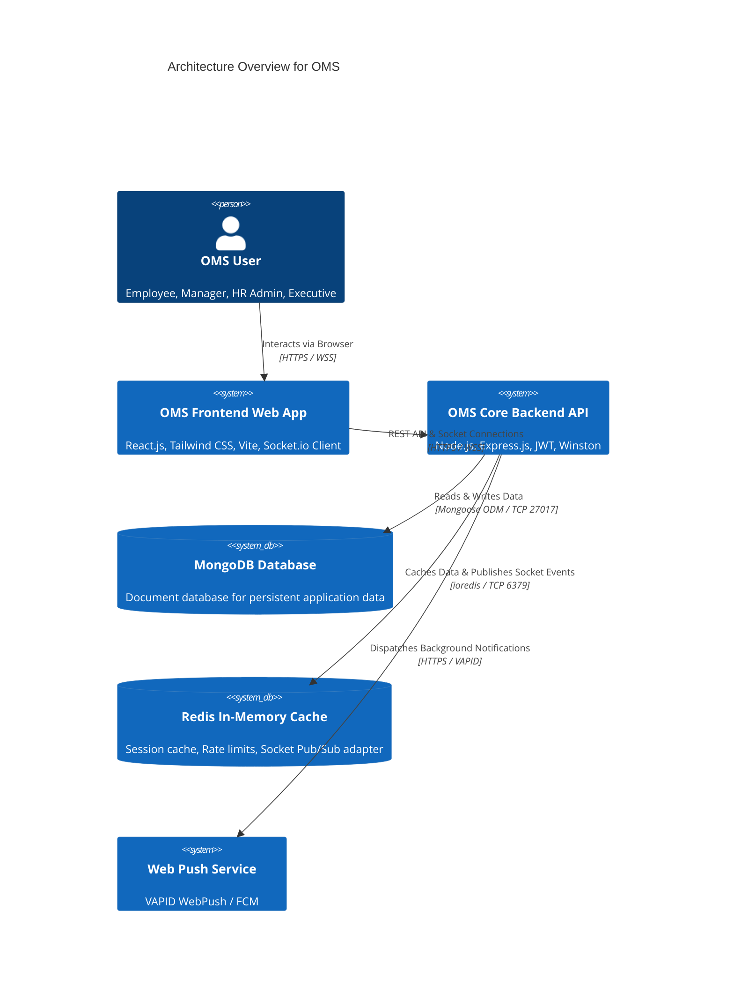
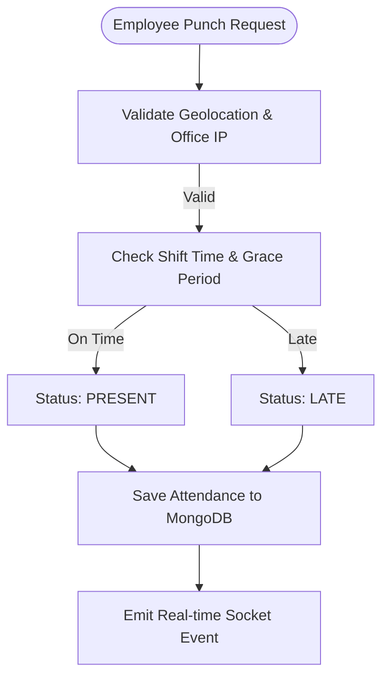

# Enterprise Technical Documentation Set: Office Management System (OMS)

**Document Version:** 2.5.0  
**Target Audience:** Developers, QA Engineers, DevOps Engineers, Project Managers, Business Analysts, Clients, Onboarding Team Members  
**System Classification:** Enterprise Operations & Resource Management System  

---

# Table of Contents
1. [Project Overview](#1-project-overview)
2. [Functional Requirements](#2-functional-requirements)
3. [Non-Functional Requirements](#3-non-functional-requirements)
4. [System Architecture](#4-system-architecture)
5. [Folder Structure](#5-folder-structure)
6. [Database Documentation](#6-database-documentation)
7. [API Documentation](#7-api-documentation)
8. [Module Documentation (All 20 Modules)](#8-module-documentation)
9. [Workflow Documentation](#9-workflow-documentation)
10. [UI Documentation](#10-ui-documentation)
11. [Security Documentation](#11-security-documentation)
12. [Testing Documentation](#12-testing-documentation)
13. [Deployment Guide](#13-deployment-guide)
14. [Troubleshooting Guide](#14-troubleshooting-guide)
15. [Change Log](#15-change-log)
16. [Future Roadmap](#16-future-roadmap)

---

# 1. Project Overview

## 1.1 Project Introduction
The **Office Management System (OMS)** is a centralized, multi-tenant enterprise application designed to streamline and automate core business operations. OMS integrates Human Resource Management (HRM), Geofenced Attendance Tracking, Multi-Tier Leave Processing, Automated Payroll & Payslip Generation, Project & Task Lifecycle Tracking, Daily Work Reporting (DWR), Key Performance Indicator (KPI) Evaluations, Real-Time Video Meetings & Chat, Internal Announcements, Web Push Notifications, Fine-Grained Role-Based Access Control (RBAC), and Analytical Reporting into a single, cohesive platform.

Built on React.js, Node.js, Express.js, MongoDB, Socket.io, and Redis, OMS delivers real-time event propagation, high performance, and high security.

## 1.2 Business Problem & Strategic Objectives
Modern organizations frequently experience friction caused by software fragmentation:
- Attendance logged in standalone bio-metric devices.
- Leave requests managed via manual email chains.
- Tasks tracked in disconnected spreadsheets or third-party boards.
- Payroll processed manually, introducing high error rates and delay risks.

OMS resolves these challenges by establishing a single source of truth, automating calculations, enforcing fine-grained security policies, and providing real-time visibility across all operational levels.

---

# 2. Functional Requirements

Coverage of OMS functional domain requirements:
- **Authentication & Security**: Multi-factor authentication (MFA), JWT dual-token authorization, session revocation list.
- **Employee Management**: Profile lifecycle, onboarding/offboarding workflows, document vault, automated ID generator (`EMP-XXXX`).
- **Attendance & Timekeeping**: Browser Web Punch with HTML5 Geo-location validation, IP restriction, automatic `Present`/`Late`/`Half-Day`/`Absent` status computation, correction workflows.
- **Leave Management**: Leave quota sandboxing, automated accruals, weekend/holiday filtering, multi-tier approval hierarchy (Manager -> HR).
- **Payroll & Salary Engine**: Dynamic salary structures, tax slab engine, automated attendance-driven unpaid leave deductions, downloadable PDF payslips.
- **Projects & Tasks**: Kanban boards, task dependencies, sub-tasks, time tracking timers, milestone burn-down tracking.
- **KPI Evaluation**: Periodic review cycles, self-appraisals, multi-rater manager scoring, auto-calculated grade bands.
- **Communications**: Real-time meeting room creation, socket-driven announcements, VAPID Web Push background notifications.

---

# 3. Non-Functional Requirements

- **Performance**: 95% of API requests respond in `<50ms`; write operations complete within `<120ms`; Socket latency `<30ms`.
- **Security**: TLS 1.3 enforced in transit, AES-256-GCM field-level encryption for sensitive PII/Financial data, OWASP Top 10 mitigation.
- **Scalability & Availability**: 99.9% operational availability SLA; stateless backend instance scaling via PM2 / Docker behind Nginx load balancers; Redis caching.
- **Logging & Auditing**: Structured JSON output via Winston logger; immutable database audit logs for all data mutations and security events.

---

# 4. System Architecture



---

# 5. Folder Structure

```
OMS/
├── backend/
│   ├── src/
│   │   ├── config/          # Database, Redis, WebPush, Socket, JWT configs
│   │   ├── database/        # Connection setup & migration seeds
│   │   ├── jobs/            # Scheduled cron jobs (Payroll, Accruals)
│   │   ├── middlewares/     # Auth, RBAC, Validation, Error Handling
│   │   ├── models/          # Global Mongoose schemas
│   │   ├── modules/         # Domain-driven feature modules (Auth, Emp, Att, Pay, etc.)
│   │   ├── security/        # Field encryption & sanitizers
│   │   ├── services/        # S3, Email, PDF services
│   │   └── utils/           # Helper utilities
│   └── server.js            # Server entry point & Socket server initialization
├── frontend/
│   ├── src/
│   │   ├── assets/          # Images, icons, static assets
│   │   ├── components/      # UI Design System components
│   │   ├── context/         # Auth, Socket, Permission contexts
│   │   ├── pages/           # View pages (Dashboard, Attendance, Payroll, etc.)
│   │   ├── services/        # Axios API client services
│   │   └── App.jsx          # Main application router
│   └── vite.config.js       # Vite build configuration
└── docs/                    # Architectural & Technical documentation suite
```

---

# 6. Database Documentation

Core MongoDB collections: `users`, `employees`, `attendances`, `leaves`, `payrolls`, `projects`, `tasks`, `workreports`, `kpi_evaluations`, `announcements`, `notifications`, `meetings`, `roles`, `permissions`, `companies`, `activity_logs`, `settings`.

Example Collection (`employees`):
```json
{
  "_id": "65b2f8a1c9e4b1001f8d4a12",
  "userId": "65b2f8a1c9e4b1001f8d4a10",
  "employeeId": "EMP-0104",
  "firstName": "John",
  "lastName": "Doe",
  "departmentId": "65b2f8a1c9e4b1001f8d4a05",
  "designation": "Senior Software Engineer",
  "joiningDate": "2024-01-15T00:00:00.000Z",
  "salaryStructure": {
    "basic": 50000,
    "hra": 20000,
    "allowance": 10000,
    "pfDeduction": 1800
  }
}
```

---

# 7. API Documentation

Exhaustive REST API endpoints providing JSON standard payloads:
- `POST /api/v1/auth/login` - User login & token generation.
- `GET /api/v1/employees` - List employees (requires `employees:read`).
- `POST /api/v1/attendance/check-in` - Web Punch In with location coordinates.
- `POST /api/v1/leaves` - Submit new leave request.
- `POST /api/v1/payroll/process` - Execute monthly payroll processing.

---

# 8. Module Documentation (All 20 Modules)

1. **Authentication**: Identity verification, MFA TOTP, dual-token JWT, account lockout.
2. **Employee Management**: Profile lifecycle, auto ID (`EMP-XXXX`), document vault.
3. **Dashboard**: Executive, HR, Manager, and Employee dynamic widget dashboards.
4. **Attendance**: Geo-fenced Web Punch, IP restriction, automatic status calculator.
5. **Leave Management**: Sandboxed quotas, multi-tier approvals, weekend/holiday filter.
6. **Payroll**: Salary engine, tax withholdings, attendance deductions, PDF payslips.
7. **Salary Management**: Component builder, appraisal increments, grade bands.
8. **Project Management**: Milestones, budget allocation, health tracking.
9. **Task Management**: Drag-and-drop Kanban boards, sub-tasks, time tracking.
10. **Daily Work Report (DWR)**: Structured end-of-day submissions & manager reviews.
11. **KPI Management**: Quarterly review cycles, multi-rater scoring, rating calculation.
12. **Notification System**: Socket.io real-time alerts + VAPID Web Push background notifications.
13. **Announcement System**: Targeted broadcast updates with mandatory read receipts.
14. **Meetings**: Room scheduling, WebRTC video links, calendar integration.
15. **Permission Matrix**: Fine-grained resource-action permission matrix (`resource:action`).
16. **Roles & Access Control**: Pre-built system roles and custom role creator.
17. **Reports & Analytics**: Exportable PDF/XLSX reporting engine.
18. **Company Settings**: Multi-tenant branding, shifts, working hours, geo-fence radius.
19. **User Profile**: Self-service details update, password change, MFA preferences.
20. **Audit Logs**: Immutable security & data mutation log trail.

---

# 9. Workflow Documentation



---

# 10. UI Documentation

Responsive single-page interface featuring dark/light glassmorphism styling, accessibility compliance, and real-time state bindings across all primary views.

---

# 11. Security Documentation

- **Authentication**: JWT RS256 algorithm with 15-minute access TTL and 7-day HTTP-Only refresh cookie.
- **Authorization**: Dynamic permission matrix interceptor evaluated at API layer.
- **Field Encryption**: AES-256-GCM for sensitive fields (SSN, Bank Details, Salary).

---

# 12. Testing Documentation

- **Unit Tests**: Jest (>=85% coverage target).
- **Integration Tests**: Supertest for REST API contracts.
- **E2E Tests**: Cypress / Playwright user journeys.
- **Performance**: k6 load scripts for API & Socket concurrency.

---

# 13. Deployment Guide

Includes environment variables template, multi-stage production Dockerfile, PM2 cluster setup, Nginx reverse proxy configuration with TLS/SSL termination, and CI/CD GitHub Actions pipeline.

---

# 14. Troubleshooting Guide

Covers resolution steps for JWT expiration issues, Socket upgrade header mismatches in Nginx, Redis rate limiter locks, and database replica set elections.

---

# 15. Change Log

| Version | Release Date | Summary of Changes | Author |
| :--- | :--- | :--- | :--- |
| v1.0.0 | 2025-01-15 | Initial Enterprise System Release | Architecture Team |
| v2.0.0 | 2025-11-20 | Added Web Push, KPI Management & Permission Matrix | Solution Architect |
| v2.5.0 | 2026-04-01 | Added Redis Distributed Caching & Audit Logging | Lead Engineer |

---

# 16. Future Roadmap

1. **Microservices Decomposition**: Refactoring into containerized domain microservices using gRPC.
2. **AI Analytics Integration**: LLM automated daily report summarization and sentiment analysis.
3. **Native Mobile Offline Sync**: React Native mobile app with SQLite offline synchronization.
